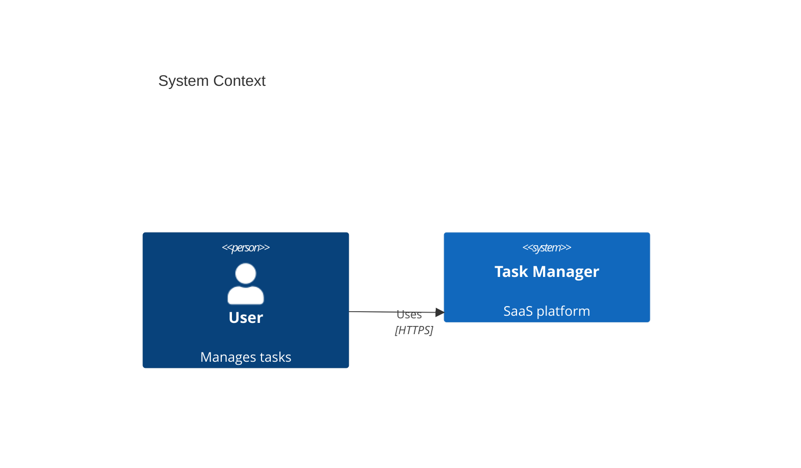
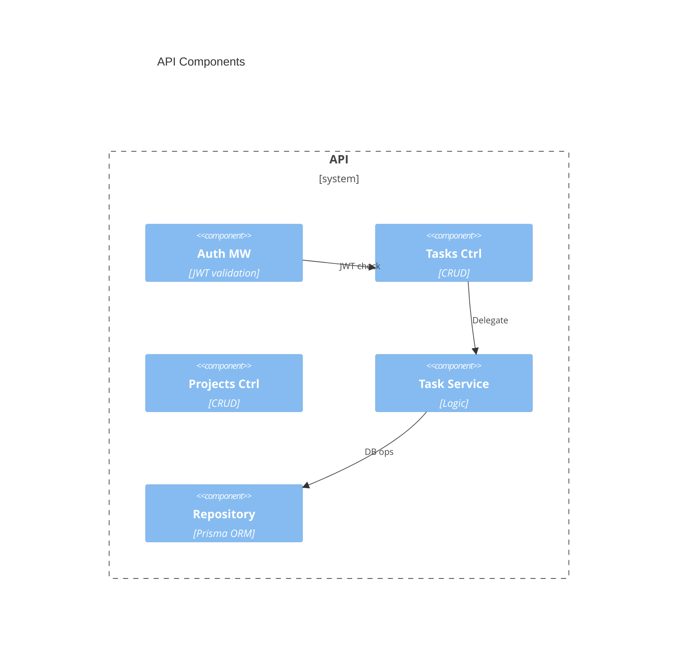

# C4 Architecture - Task Manager SaaS

## System Context



## Containers

```mermaid
C4Container
    title Containers
    Container_Boundary(app, "App") {
        Container(web, "Web App", "React/Next.js", "UI")
        Container(api, "API Server", "Node.js/Fastify", "REST API")
        ContainerDb(db, "PostgreSQL", "RDBMS", "Data store")
        Cache(cache, "Redis", "Cache", "Sessions")
    }
    Ext(notif, "Notifications", "AWS SES/SNS", "Email/push")
    Ext(auth, "Auth", "Auth0/OAuth", "Login")
    Rel(web, api, "JSON", "HTTPS")
    Rel(api, db, "SQL", "")
    Rel(api, cache, "", "")
```

## Components



## Decisions

| Choice | Why |
|-------|-----|
| Next.js | SSR + React |
| Fastify | Fast |
| PostgreSQL | ACID |
| Redis | Speed |
| Prisma | Typesafe |

Copy to skills/c4-architecture/references/ and customize.
